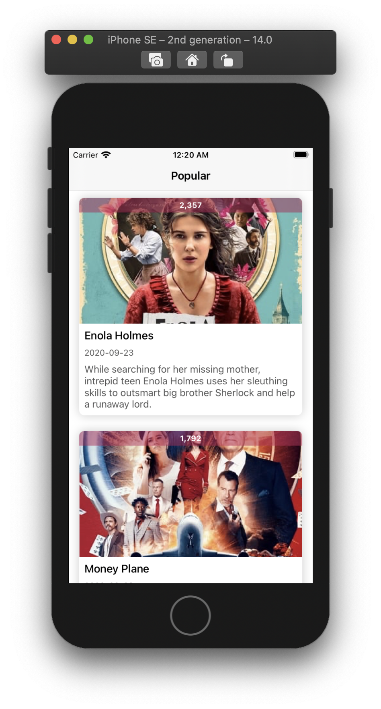
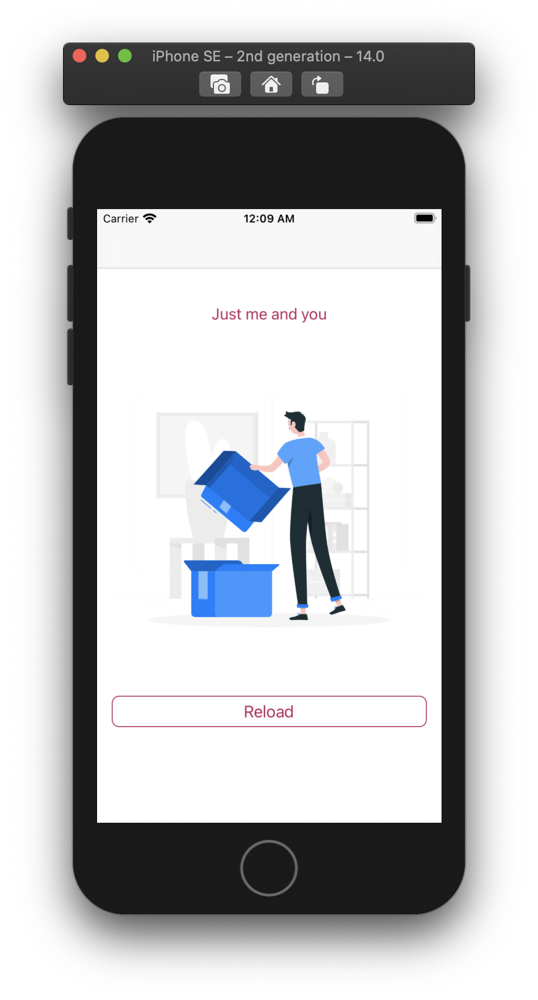
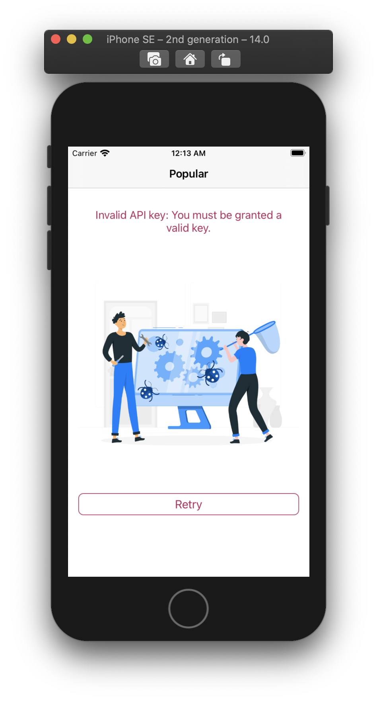
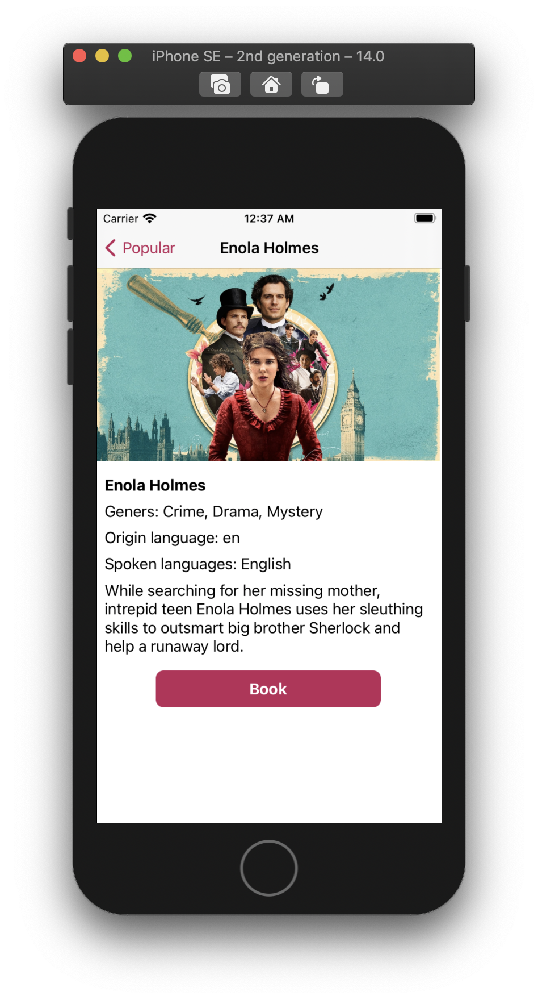

# Movieable
- Vanilla `MVVM` + `Combine` implementation.
- Decoupled Presentation, Business Logic, and Data Access layers
- Programmatic navigation with Coordinator
- Simple yet flexible networking layer built on Generics with server's response error handling
- Designed for scalability. It can be used as a reference for building large production applications
- Code convetion constraints with SwiftLint
- Assets generation by SwiftGen
- Environment management with Natrium
- Build-in `StateMachine` manage statefull views, there are four state: `idle`, `isLoading(last:)`, `loaded(:)`, `failed(error:)`

